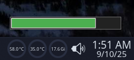

# Tickbar

A sleek, cross-platform timer bar with a minimalist design, perfect for tracking time in games, productivity tasks, or any activity needing a visual countdown. Featuring a customizable duration, sound effects, and a modern interface, Tick Bar is lightweight and stays on top of your screen for easy access.

## Features
- **Customizable Timer**: Set durations from 1 to 600 seconds via a clean, borderless dialog.
- **Cross-Platform**: Runs smoothly on Linux and Windows with a consistent experience.
- **Minimalist Design**: Borderless progress bar with a vibrant startup animation (color wave, size pulse, typewriter effect).
- **Sound Effects**: Optional ticking sound (`tick.wav`) for each cycle, toggleable via right-click menu.
- **Interactive**: Resize (4px margin), drag, and always-on-top (except during menu interactions on Windows).
- **Right-Click Menu**: Access "Set Timer", "Enable Sound", and "Close" with a native feel on both platforms.

## Why Download?
Tick Bar is ideal for:
- **Gamers**: Time in-game events or cooldowns with a non-intrusive overlay.
- **Productivity Enthusiasts**: Track Pomodoro sessions or short tasks visually.
- **Developers**: A lightweight tool to test or integrate into larger projects.

Its small footprint (~500KB with `tick.wav`) and cross-platform compatibility make it a unique addition to your toolkit. Whether you're timing a speedrun or a study session, Tick Bar delivers a polished, distraction-free experience.

## Installation
1. **Clone the Repository**:

   git clone https://github.com/bytesentry/tickbar.git
   cd tickbar

2. **Install Dependencies**:

   pip install -r requirements.txt

Ensure `pygame` is installed for sound support on Linux.
3. **Run the App**:

   python3 tickbar.py

On Windows, use `python tickbar.py` or a PyInstaller executable (see below).

## Requirements
- **Python**: 3.6+
- **Dependencies**: `pygame` (for Linux sound; included in `requirements.txt`)
- **Files**: `tick.wav` (included for sound effects)
- **OS**: Tested on Arch Linux (X11/Wayland) and Windows 10/11

## Building an Executable
To distribute as a standalone app:

pip install pyinstaller
pyinstaller --onefile --add-data "tick.wav;." tickbar.py

- On Linux, find the executable in `dist/tickbar`.
- On Windows, use `pyinstaller --onefile --add-data "tick.wav;." tickbar.py` (use `;` for Windows paths).

## Usage
- **Start/Stop**: Left-click the bar to toggle the timer.
- **Customize**: Right-click for a menu to set duration (1-600s), toggle sound, or close.
- **Move/Resize**: Drag the bar or use edges (4px margin) to resize (226x26 to 452x52 pixels).
- **Sound**: Ticking plays per cycle if enabled (requires `tick.wav`).

## Screenshots

## License
MIT License - feel free to use, modify, or distribute!

## Contributing
Ideas or bug reports? Open an issue or submit a pull request. Let's make Tick Bar even better!

## Acknowledgments
- Built with Python and Tkinter for a lightweight, cross-platform experience.
- Inspired by minimalist productivity tools and gaming overlays.

